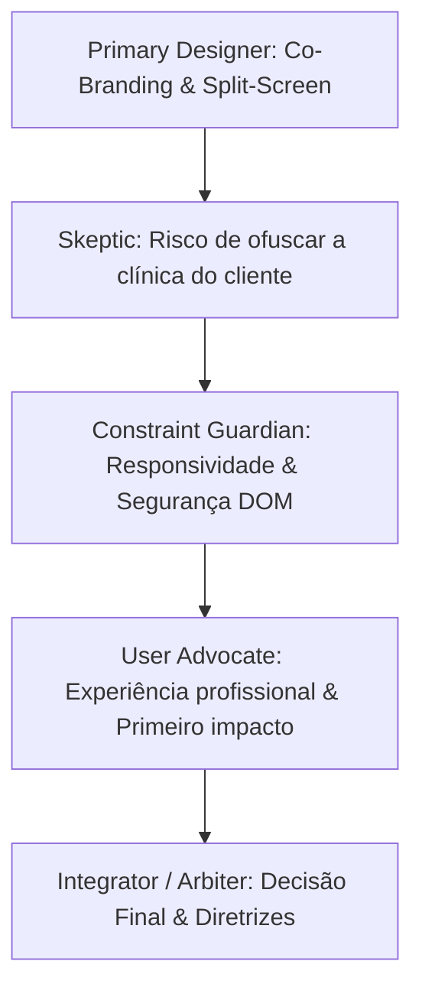

# 🎨 Sessão Multi-Agent Brainstorming: Identidade Visual, 3 Logos & Tela de Acesso Primária — Synapsis Clínico

> **Status:** APROVADO PELO ÁRBITRO MULTI-AGENTE  
> **Data:** 16 de Setembro de 2026  
> **Participantes:** Primary Designer (Lead), Skeptic/Challenger, Constraint Guardian, User Advocate e Integrator/Arbiter.

---

## 🎯 Escopo da Sessão

1. Criação e disponibilização na raiz do projeto de **3 opções de Logos conceituais** para o **Synapsis Clínico**.
2. Estudo de arquitetura para **Co-Branding no Header/Sidebar**: Como manter a marca Synapsis Clínico sempre visível com elegância, sem anular nem disputar espaço com a logo personalizada do consultório/clínica.
3. Reformulação da **Tela de Acesso Primária (Login)**: Substituir o modal flutuante por uma experiência de entrada imersiva em tela cheia, alinhada à sofisticação da Landing Page (Nome, Slogan, Selos de Segurança CFP/LGPD e suporte à logo da clínica).

---

## 💎 As 3 Opções de Logo Geradas na Raiz do Projeto

Os arquivos vetoriais em formato `.svg` de alta resolução já foram criados diretamente na raiz do projeto:

### 1. `logo-synapsis-opcao1.svg` — **A Sinapse Psi (Neural & Clínica)**
* **Conceito:** A clássica letra grega da Psicologia (**Ψ - Psi**) reinterpretada geometricamente através de feixes neurais interconectados com nós luminosos em verde esmeralda (`#2dd4bf`) e toques de violeta/neuro (`#a855f7`).
* **Mensagem:** O casamento perfeito entre a tradição da prática clínica e a vanguarda da neurociência e tecnologia.
* **Uso Ideal:** Excelente para ícone de aplicativo, favicon e símbolo reduzido no Header.

### 2. `logo-synapsis-opcao2.svg` — **O Pulso Neural Dinâmico (Neuro-Flow / Órbitas)**
* **Conceito:** Duas órbitas sinápticas elípticas que se cruzam formando a silhueta de um cérebro / infinito com um núcleo luminoso central que representa o "insight" terapêutico e a velocidade de dados.
* **Mensagem:** Agilidade, fluxo contínuo de trabalho, inteligência e dinamismo operacional.
* **Uso Ideal:** Ideal para plataformas digitais modernas e apelo voltado a clínicas multidisciplinares.

### 3. `logo-synapsis-opcao3.svg` — **O Escudo Hexagonal Sináptico (Blindagem & Ciência)**
* **Conceito:** Estrutura hexagonal (rede molecular / sináptica) contendo em seu interior uma cruz clínica facetada e o nó central de estabilidade.
* **Mensagem:** Autoridade médica inquestionável, segurança jurídica perante o CFP, imutabilidade com SHA-256 e proteção do caixa.
* **Uso Ideal:** Transmite solidez institucional máxima para grandes clínicas e consultórios consolidados.

---

## 🔍 Ciclo de Revisão Multi-Agente (Structured Review)

### 1️⃣ Objeções do Skeptic / Challenger:
* *"Se o dono da clínica pagou pela licença do sistema, ele quer que a secretária e os psicólogos vejam a marca DELE no topo, não um logotipo de software gigante brigando por atenção."*
* *"Na tela de login, se colocarmos muitos elementos visuais, pode parecer uma página de vendas em vez de um sistema de trabalho sóbrio e confiável."*

### 2️⃣ Diretrizes do Constraint Guardian:
* *No Header:* O espaço horizontal é escasso em telas menores (tablets e notebooks compactos). O co-branding deve ocupar no máximo 32px de altura e não quebrar com a logo da clínica.
* *Na Autenticação:* Atualmente, o `App.tsx` monta o Dashboard e o Sidebar por trás de um modal transparente escurecido. Isso é uma falha de arquitetura: **se o usuário não está autenticado, nenhum componente interno do sistema deve ser renderizado no DOM**. A nova tela de login primária deve ser um componente isolado renderizado condicionalmente antes do carregamento do sistema.

### 3️⃣ Perspectiva do User Advocate:
* O momento do login é o primeiro ritual diário do psicólogo. Entrar em uma tela sofisticada, com o slogan inspirador e os selos de certificação do CFP e criptografia AES-256 gera sensação de segurança e orgulho profissional.
* A personalização deve ser elegante: se a clínica tiver sua logo configurada, ela aparece com boas-vindas: *"Acesso ao Consultório [Logo da Clínica] • powered by Synapsis Clínico"*.

---

## ⚖️ Veredito do Integrator / Arbiter & Decisões Arquiteturais

### Decisão 1: Dual Branding / Co-Branding no Header e Sidebar
1. **No Topo Esquerdo do Header:**
   * Se a clínica cadastrou sua logo (`clinicSettings.logo_base64`):
     * Exibe a **Logo da Clínica** em destaque como elemento primário.
     * Imediatamente ao lado ou abaixo, exibe o **Símbolo do Synapsis Clínico** em miniatura (ícone de 20px) com o texto sutil `powered by Synapsis Clínico`.
   * Se a clínica NÃO cadastrou logo:
     * O **Símbolo + Nome do Synapsis Clínico** assume o espaço com destaque e sofisticação.
2. **No Rodapé da Barra Lateral (Sidebar):**
   * Exibição permanente de um rodapé discreto com o símbolo do Synapsis Clínico, versão da plataforma e o indicador de segurança: `🔒 Criptografia AES-256 (CFP 06/2019)`.

### Decisão 2: Nova Tela de Acesso Primária Fullscreen Split-Screen
* **Estrutura 50/50 em Desktop:**
  * **Lado Esquerdo (Showcase Synapsis Clínico):**
    * Fundo escuro premium (`slate-950` com gradiente radial esmeralda).
    * Logo oficial do **Synapsis Clínico** (com a opção de símbolo escolhida).
    * O Slogan Aprovado: *"A conexão definitiva entre a ciência clínica, a neuropsicologia e a gestão do seu consultório."*
    * Badges de Confiança: `Hash SHA-256 (CFP 06/2019)`, `Criptografia AES-256-GCM`, `Art. 18 LGPD`.
    * Card sutil de Boas-Vindas da Clínica (se houver logo/nome configurado).
  * **Lado Direito (Área de Entrada Segura):**
    * Card de autenticação com campos estilizados de E-mail e Senha.
    * Link para fluxo de recuperação de senha com link temporário de 1 hora.
    * Botão primário com gradiente esmeralda: *"Acessar Consultório"*.
    * Seletor de Perfis de Teste / Demonstração (Admin, Dr. Marcos, Dra. Camila, Recepção) mantido para facilidade de avaliação.

---

## 📋 Decision Log (Registro Formal)

| Item | Decisão Tomada | Justificativa / Racional |
| :--- | :--- | :--- |
| **Arquitetura da Tela de Login** | Tela Fullscreen Dedicada (Split-Screen) | Elimina a renderização antecipada do Dashboard no DOM sem autenticação e eleva a percepção de valor do software. |
| **Presença de Marca no Header** | Co-Branding com Selo *"Powered by Synapsis Clínico"* | Respeita a identidade da clínica contratante enquanto fixa a presença de marca do software de forma profissional. |
| **Slogan na Tela de Login** | *"A conexão definitiva entre a ciência clínica, a neuropsicologia e a gestão do seu consultório."* | Conecta a experiência da Landing Page com a experiência do produto real. |
| **Arquivos de Logo** | 3 SVGs vetoriais na raiz (`opcao1`, `opcao2`, `opcao3`) | Zero perda de resolução, leves (< 4KB cada) e prontos para uso em web, mobile e documentos timbrados. |
