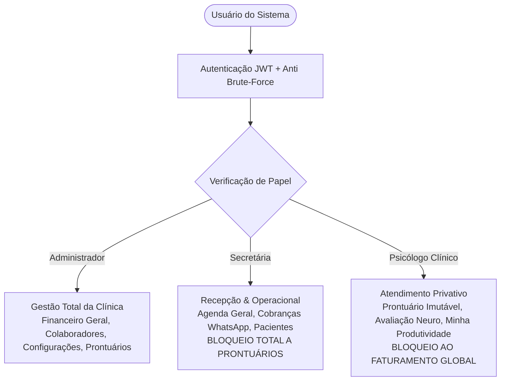

# PsicoGestão SaaS — Manual Executivo & Documentação Comercial Completa da Plataforma
**Solução Integrada de Gestão Clínica, Prontuário Eletrônico Imutável, Sigilo Ético (CFP/LGPD) e Engenharia Financeira para Clínicas de Psicologia e Neuropsicologia**

---

## Sumário Executivo

O **PsicoGestão** é uma plataforma SaaS (*Software as a Service*) de última geração projetada especificamente para atender às demandas de consultórios de psicologia, centros de avaliação neuropsicológica e clínicas multidisciplinares de saúde mental.

Diferente de ERPs médicos genéricos que tratam a psicologia apenas como uma especialidade médica convencional, o PsicoGestão foi concebido desde sua fundação com base em três pilares inegociáveis:
1. **Conformidade Ético-Legal Estrita:** Alinhamento nativo com as Resoluções do Conselho Federal de Psicologia (CFP nº 01/2009 e 06/2019) e com a Lei Geral de Proteção de Dados (LGPD - Lei 13.709/2018).
2. **Arquitetura de Sigilo e Zero-Knowledge:** Separação absoluta entre dados administrativos/financeiros e anotações clínicas confidenciais. A secretária nunca acessa prontuários; o psicólogo nunca acessa os custos e o faturamento global da clínica; os gestores mantêm o controle total da operação.
3. **Engenharia Financeira & Repasse de Honorários Automatizado:** Solução completa para o maior gargalo operacional de clínicas com múltiplos profissionais: rateio transparente de honorários por percentual ou valor fixo, fechamento de lotes mensais com 1 clique e extratos auditáveis em PDF com chave PIX integrada.

---

## 1. Visão Geral da Arquitetura & Perfis de Acesso (RBAC)

A plataforma implementa Controle de Acesso Baseado em Papéis (*Role-Based Access Control* - RBAC) rigoroso, garantindo que cada colaborador acesse exclusivamente as informações indispensáveis para o exercício de sua função.



### Perfis Nativos

| Perfil | Acesso Clínico (Prontuário/Evoluções) | Acesso Financeiro Global | Gestão de Repasses | Agenda & Pacientes | Gestão de Colaboradores & Clínica |
| :--- | :---: | :---: | :---: | :---: | :---: |
| **Administrador (Gestor / Dono da Clínica)** | ✅ Total | ✅ Total | ✅ Total (Configuração, Lotes, Pagamento) | ✅ Todos os Profissionais | ✅ Total (Contratação, Bloqueios, Políticas) |
| **Secretária (Recepção & Apoio Operacional)** | ❌ Bloqueado por Sigilo Ético | ⚠️ Operacional (Cobranças WhatsApp e Recibos) | 👁️ Visualização de Produtividade da Equipe | ✅ Todos os Profissionais | ❌ Bloqueado |
| **Psicólogo Clínico / Neuropsicólogo** | ✅ Exclusivo de seus Pacientes | ❌ Bloqueado (Zero-Knowledge) | 👁️ Apenas o Próprio Extrato ("Minha Produtividade") | 👁️ Apenas a Própria Agenda | ❌ Bloqueado |

---

## 2. Pilares de Segurança, Criptografia e Conformidade Regulatória

### 2.1. Criptografia em Repouso AES-256-GCM
Todos os textos clínicos confidenciais — queixas principais, histórico familiar, anotações de sessões, hipóteses diagnósticas e observações sensíveis — são criptografados no banco de dados utilizando **AES-256-GCM** (*Galois/Counter Mode*) com vetor de inicialização (IV) exclusivo por registro.
* Mesmo em caso de vazamento físico do banco de dados, os registros clínicos permanecem indecifráveis sem a chave mestra da aplicação.

### 2.2. Imutabilidade e Integridade com Hash SHA-256 (CFP 06/2019)
Em conformidade direta com a Resolução CFP nº 06/2019, que exige que registros documentais em psicologia não sofram alterações retroativas ou adulterações:
* Cada evolução assinada pelo psicólogo gera uma assinatura digital irreversível baseada no algoritmo **SHA-256**.
* O hash sintetiza: *ID da Sessão + ID do Paciente + Timestamp + CRP do Psicólogo + Conteúdo Clínico Integral*.
* Qualquer tentativa de adulteração externa invalida o hash, servindo como prova de integridade jurídica em perícias e sindicâncias do Conselho Regional de Psicologia (CRP).

### 2.3. Trilha de Auditoria LGPD (*Audit Logs*)
O sistema mantém uma tabela de auditoria permanente e indelével que registra:
* Usuário solicitante (ID, e-mail e papel).
* Ação executada (Leitura de prontuário, exportação de laudo, tentativa de acesso proibido, login, alteração de parâmetros).
* Endereço IP e carimbo de data/hora precisa (ISO UTC).
* Acesso negado a secretárias que tentam acessar prontuários é registrado automaticamente com alerta de segurança.

### 2.4. Proteção Ativa Anti Brute-Force & Kill Switch
* **Anti Brute-Force:** Contas que apresentarem 5 tentativas consecutivas de senha incorreta são automaticamente bloqueadas por 15 minutos, registrando o incidente na trilha de auditoria.
* **Kill Switch Instantâneo (`token_version`):** Em caso de desligamento de colaborador ou perda de dispositivo móvel, o Administrador pode suspender a conta com 1 clique; todos os tokens JWT emitidos para aquele usuário são imediatamente invalidados pelo servidor.

---

## 3. Módulos Funcionais Detalhados

---

### Módulo 1: Painel Principal / Recepção Inteligente (Dashboard)

O Dashboard do PsicoGestão opera como a **Torre de Controle Operacional** da clínica. Ele consolida em uma única tela todas as informações cruciais para o turno de trabalho sem poluição visual.

```
+-----------------------------------------------------------------------------------------+
| [Ψ PsicoGestão]    Painel do Dia • Terça-feira, 16 de Setembro de 2026                 |
+-----------------------------------------------------------------------------------------+
| [ 12 Sessões Hoje ]  [ 9 Confirmadas (75%) ]  [ 3 Pendentes no Turno ]  [ 2 Aniversários ]|
+-----------------------------------------------------------------------------------------+
| EQUIPE CLÍNICA                  | LINHA DO TEMPO DOS ATENDIMENTOS DO DIA                |
| • Toda a Clínica (Geral)        | [08:00 - 08:50] Carlos Mendes • Dr. Marcos [Online]   |
| • Dr. Marcos (Em atendimento)   | [09:00 - 09:50] Beatriz Silva • Dr. Marcos [Presenc.] |
| • Dra. Juliana (Próximo às 10h) | [10:00 - 10:50] Lucas Souza • Dra. Juliana [Presenc.] |
| • Dr. Thiago (Livre hoje)       | [11:00 - 11:50] Mariana Rios • Dr. Marcos [Presenc.]  |
+-----------------------------------------------------------------------------------------+
```

#### Principais Funcionalidades:
1. **Métricas Rápidas em Tempo Real:**
   * Total de atendimentos programados para o dia vigente.
   * Percentual de presenças confirmadas versus pendências.
   * Atendimentos restantes para encerramento do expediente.
   * Alertas de aniversariantes da semana.
2. **Status Dinâmico da Equipe Clínica:**
   * Badges inteligentes por terapeuta:
     * 🟢 *Em atendimento agora* (com indicador pulsante em tempo real).
     * 🟡 *Próximo às HH:MM* (com indicação do horário do próximo paciente).
     * 🔵 *Sessões encerradas no dia*.
     * ⚪ *Livre hoje* (agenda sem marcações para a data).
3. **Timeline Interativa de Atendimentos:**
   * Identificação de paciente, terapeuta responsável, modalidade (Presencial ou Online).
   * Seletor de alteração instantânea de status (*Agendado*, *Confirmado*, *Realizado*, *Falta/No-Show*, *Cancelado*).
   * Botão de 1 clique para envio de confirmação via WhatsApp.
   * Atalho seguro para iniciar a evolução no prontuário do paciente (disponível exclusivamente para psicólogos e administradores).
4. **Widget de Aniversariantes com WhatsApp Automatizado:**
   * Rastreia aniversariantes do dia e dos próximos 7 dias.
   * Disparo em 1 clique de mensagem cordial personalizada com o primeiro nome do paciente e o nome da clínica/terapeuta, respeitando o tom formal e acolhedor exigido na psicologia.

---

### Módulo 2: Agenda Clínica Multiprofissional Integrada

Desenvolvida especificamente para o ritmo de consultas de 50 minutos e processos de avaliação com múltiplos encontros.

#### Principais Funcionalidades:
1. **Múltiplas Visões de Calendário:**
   * Visualização Diária, Semanal, Mensal e em Lista.
   * Alternância ágil entre a visão de um psicólogo individual ou a visão consolidada de todas as salas da clínica.
2. **Modalidades de Atendimento:**
   * Suporte nativo para **Presencial** (com designação de sala/consultório) e **Online** (com campo para link da sala virtual: Google Meet, Zoom, etc.).
3. **Tipificação de Sessões:**
   * Sessão Avulsa / Primeira Consulta.
   * Sessão Recorrente de Psicoterapia.
   * Sessão de Avaliação Neuropsicológica (vinculada a pacotes de sessões).
   * Sessão de Devolutiva / Entrega de Laudo.
4. **Régua de Confirmação e Lembretes via WhatsApp:**
   * Integração direta com WhatsApp Web e WhatsApp Desktop sem necessidade de contratação de gateways caros de terceiros.
   * Geração de textos padronizados e elegantes de confirmação de presença.
5. **Roteamento Inteligente de WhatsApp para Responsáveis:**
   * Quando o paciente é menor de idade ou dependente, o sistema identifica automaticamente os responsáveis cadastrados (Mãe, Pai, Cônjuge ou Tutor Financeiro) e oferece um seletor rápido para escolher para qual número a mensagem deve ser enviada.
   * Previne erros operacionais graves, como enviar lembretes para celulares de crianças.

---

### Módulo 3: Prontuário Eletrônico Imutável & Evoluções (Resolução CFP 06/2019)

O coração da prática psicológica. Estruturado de forma a orientar o profissional no cumprimento rigoroso do padrão documental do CFP, eliminando riscos de penalidades éticas.

```
+-----------------------------------------------------------------------------------------+
| [PRONTUÁRIO CLÍNICO ELETRÔNICO] • Paciente: Carlos Mendes (Prontuário #0042)            |
| Terapeuta Responsável: Dr. Marcos Silveira (CRP 06/128945-SP)                           |
+-----------------------------------------------------------------------------------------+
| 1. IDENTIFICAÇÃO DO PACIENTE E DADOS DEMOGRÁFICOS                                       |
| Idade: 34 anos • Estado Civil: Casado • Ocupação: Engenheiro de Software                |
+-----------------------------------------------------------------------------------------+
| 2. REGISTRO DE DEMANDA E OBJETIVOS TERAPÊUTICOS                                         |
| Queixa: Sintomas compatíveis com Transtorno de Ansiedade Generalizada (TAG).            |
+-----------------------------------------------------------------------------------------+
| 3. EVOLUÇÃO CLÍNICA DA SESSÃO (CFP 06/2019)                                            |
| [ Sessão #08 • 16/09/2026 • 50 min • Presencial • Realizada ]                           |
| Relato Clínico: Paciente relata melhora na qualidade do sono após técnicas de higiene...|
| Intervenções: Reestruturação cognitiva sobre pensamentos catastróficos no trabalho...   |
+-----------------------------------------------------------------------------------------+
| [🔒 ASSINAR EVOLUÇÃO & GERAR HASH SHA-256]                                              |
| Hash Gerado: 7b3a98c1f4e92d... (Registro Imutável em Repouso AES-256)                   |
+-----------------------------------------------------------------------------------------+
```

#### Principais Funcionalidades:
1. **As 5 Seções Obrigatórias do CFP:**
   * *Seção I:* Dados cadastrais e demográficos do paciente.
   * *Seção II:* Demanda inicial, hipóteses clínicas e plano de atendimento.
   * *Seção III:* Registro objetivo dos atendimentos (data, horário, modalidade e comparecimento).
   * *Seção IV:* Registro da evolução contínua, estratégias de intervenção empregadas e respostas do paciente.
   * *Seção V:* Registro de encaminhamentos, relatórios interprofissionais e encerramento.
2. **Editor Clínico com Salvamento Seguro:**
   * Permite salvar rascunhos durante a sessão.
   * Botão de **Assinatura Eletrônica Definitiva**: uma vez assinado, o registro é bloqueado para edição e ganha carimbo de data, hora e hash SHA-256.
3. **Linha do Tempo Cronológica do Paciente:**
   * Histórico visual de todas as consultas já realizadas.
   * Filtros por ano, tipo de intervenção e palavras-chave.
4. **Blindagem Jurídica para a Clínica:**
   * Em caso de fiscalização do Conselho ou determinação judicial de compartilhamento de prontuário, a clínica exporta relatórios fidedignos com histórico auditável e integridade criptográfica.

---

### Módulo 4: Avaliações Neuropsicológicas & Emissão de Laudos

Módulo exclusivo desenvolvido para neuropsicólogos e especialistas em psicometria, capaz de gerenciar desde o contrato inicial até a entrega do laudo final.

#### Principais Funcionalidades:
1. **Controle de Pacotes de Avaliação:**
   * Criação de processo de avaliação neuropsicológica com definição do número total de sessões planejadas (ex: 6 a 10 sessões: anamnese, testagem cognitiva, escalas comportamentais e devolutiva).
   * Contador visual de progresso: sessões realizadas vs. sessões pendentes.
2. **Registro de Instrumentos e Testes:**
   * Cadastro e organização dos testes administrados (ex: WISC-IV, WAIS-III, BPA, Neupsilin, FDT, BDEFS, etc.).
   * Registro de escores brutos, percentis e classificações normativas.
3. **Editor e Gerador de Laudo Neuropsicológico Estruturado:**
   * Modelo profissional de laudo contendo seções padronizadas:
     * *Identificação e Motivo do Encaminhamento* (neurologistas, psiquiatras, escolas).
     * *Histórico do Desenvolvimento e Anamnese*.
     * *Comportamento Observado durante as Sessões de Testagem*.
     * *Instrumentos e Procedimentos Utilizados*.
     * *Resultados e Análise Neuropsicológica por Funções* (Atenção, Memória, Funções Executivas, Linguagem, Praxias).
     * *Conclusão Diagnóstica* (CID-11 / DSM-5) e *Diretrizes Terapêuticas / Reabilitação*.
4. **Faturamento Especializado de Avaliações:**
   * Opção de cobrança única do pacote completo ou cobrança parcelada vinculada ao módulo financeiro.
   * Taxa de repasse contratual independente (ex: o neuropsicólogo pode ter 60% em terapia e 70% em avaliação neuro).
   * Emissão de recibos parciais ou finais discriminando o processo avaliativo.

---

### Módulo 5: Hub de Escalas Psicométricas e Rastreio Clínico

Ferramenta para aplicação e monitoramento quantitativo da eficácia terapêutica.

#### Principais Funcionalidades:
1. **Catálogo de Instrumentos de Rastreio:**
   * Escalas padrão-ouro disponíveis para preenchimento rápido (BDI para depressão, BAI para ansiedade, escalas de estresse e rastreio cognitivo).
2. **Cálculo Automático de Escores:**
   * O psicólogo assinala os pontos e a plataforma calcula automaticamente o escore total e indica a faixa de gravidade (Mínimo, Leve, Moderado, Grave).
3. **Histórico e Comparação Longitudinal:**
   * Visualização da trajetória dos escores ao longo dos meses para avaliar a evolução clínica do paciente e respaldar a alta terapêutica.

---

### Módulo 6: Gestão de Pacientes (Prontuário 360° & Documentação)

Ficha centralizada do paciente que reúne dados cadastrais, clínicos, jurídicos e financeiros.

#### Principais Funcionalidades:
1. **Cadastro Completo com Validação Real:**
   * Validação algorítmica estrita de CPF (dígitos verificadores oficiais da Receita Federal).
   * Dados de nascimento com cálculo instantâneo da idade e indicação automática de maioridade/menoridade.
   * Endereço com busca integrada e contatos de emergência.
2. **Múltiplos Responsáveis Legais e Financeiros:**
   * Cadastro de mãe, pai, cônjuge, curador ou tutor legal.
   * Designação clara de **Quem é o Responsável Financeiro** (para quem saem os recibos de IR e as cobranças de WhatsApp) e **Quem é o Responsável Legal** (para termos de consentimento e contato).
3. **Central de Documentos e Atestados com Tags Dinâmicas:**
   * Geração com 1 clique de:
     * *Atestado Psicológico* (Resolução CFP 06/2019).
     * *Declaração de Comparecimento*.
     * *Contrato de Prestação de Serviços Psicológicos*.
     * *Termo de Consentimento Livre e Esclarecido (TCLE)*.
   * Preenchimento automático com tags como `{{nome_paciente}}`, `{{cpf_paciente}}`, `{{data_hoje}}`, `{{nome_terapeuta}}`, `{{crp_terapeuta}}`.
   * Exportação para PDF timbrado pronto para impressão ou assinatura digital.

---

### Módulo 7: Gestão Financeira, Fluxo de Caixa & Régua de Cobrança

Engenharia financeira completa para o consultório, sem necessidade de ferramentas externas ou planilhas paralelas de Excel.

```
+-----------------------------------------------------------------------------------------+
| [MÓDULO FINANCEIRO] • Gestão e Fluxo de Caixa da Clínica                                |
+-----------------------------------------------------------------------------------------+
| [RECEITAS (Honorários)] [DESPESAS (Contas)] [COBRANÇAS (WhatsApp)] [NOTAS FISCAIS]      |
+-----------------------------------------------------------------------------------------+
| Total Recebido (Mês): R$ 38.450,00 | A Receber: R$ 5.200,00 | Inadimplência: 2.1%       |
+-----------------------------------------------------------------------------------------+
| FILTROS: [Período: Mês Atual] [Terapeuta: Todos] [Status: Pendente] [Serviço: Psicoterap]|
|                                                                                         |
| Paciente          | Terapeuta     | Valor Bruto | Status    | Ação                      |
| Carlos Mendes     | Dr. Marcos    | R$ 220,00   | PAGO      | [Ver Recibo]              |
| Beatriz Silva     | Dr. Marcos    | R$ 220,00   | PENDENTE  | [📱 Cobrança WhatsApp]    |
| Lucas Souza (Neuro)| Dra. Juliana | R$ 1.800,00 | PENDENTE  | [📱 Cobrança WhatsApp]    |
+-----------------------------------------------------------------------------------------+
```

#### Principais Funcionalidades:
1. **Controle de Receitas (Honorários):**
   * Lançamento de sessões avulsas, pacotes mensais e processos de avaliação.
   * Registro do método de pagamento: PIX, Cartão de Crédito, Débito, Dinheiro, Transferência Bancária.
   * Status de quitação em tempo real (Pago / Pendente).
2. **Controle de Despesas Operacionais:**
   * Cadastro e liquidação de contas a pagar da clínica: aluguel, condomínio, internet, limpeza, software, supervisão clínica, compra de testes psicológicos e materiais.
   * Demonstração clara de receitas brutas, custos operacionais e resultado líquido da clínica.
3. **Régua de Cobrança Automatizada via WhatsApp:**
   * Painel de contas a receber e vencidas.
   * Botão de 1 clique que monta uma mensagem amigável, ética e transparente com a data do atendimento, valor exato e a chave PIX da clínica, enviando para o paciente ou responsável financeiro.
4. **Módulo de Notas Fiscais e Recibos (IRPF / DMED):**
   * Emissão de recibos formais de prestação de serviços psicológicos no padrão exigido pela Receita Federal para declaração de IRPF pelo paciente (com indicação do CPF do pagador e CRP do terapeuta).
   * Controle de número de NF-e para faturamento emitido pela clínica.

---

### Módulo 8: Sistema de Repasse de Honorários aos Psicólogos (Comissionamento)

O divisor de águas na gestão de clínicas com múltiplos terapeutas. Elimina horas de conferência manual de planilhas e evita desgastes na relação entre a clínica e os profissionais parceiros.

```
+-----------------------------------------------------------------------------------------+
| [GESTÃO DE REPASSES] • Fechamento de Lote Periódico                                     |
| Profissional: Dr. Marcos Silveira (CRP 06/128945-SP)                                     |
| Período: 01/09/2026 a 30/09/2026 • Modalidade Contratual: 60% Psicoterapia / 70% Neuro   |
+-----------------------------------------------------------------------------------------+
| ATENDIMENTOS ELEGÍVEIS (Apenas sessões quitadas pelo paciente):                         |
| • 24 Atendimentos de Psicoterapia Realizados (Total Bruto: R$ 5.280,00)                  |
| • Subtotal de Repasse (60%): R$ 3.168,00                                                |
|                                                                                         |
| AJUSTES DE LOTE:                                                                        |
| • (+) Acréscimo: R$ 250,00 (Supervisão Clínica em Grupo)                                |
| • (-) Dedução: R$ 100,00 (Rateio de compra de materiais de consultório)                 |
|                                                                                         |
| VALOR LÍQUIDO A PAGAR: R$ 3.318,00 • Chave PIX: marcos@psicogestao.com.br (E-mail)      |
+-----------------------------------------------------------------------------------------+
| [🔒 FECHAR LOTE OFICIAL & GERAR PDF TIMBRADO]                                           |
+-----------------------------------------------------------------------------------------+
```

#### Principais Funcionalidades:
1. **Regra de Ouro da Plataforma:**
   * **Apenas sessões efetivamente pagas pelo paciente tornam-se elegíveis para repasse.**
   * A clínica nunca adianta dinheiro do próprio caixa para honorários de consultas não pagas, blindando seu fluxo financeiro contra calotes.
2. **Flexibilidade Contratual por Profissional:**
   * Modelo Percentual (ex: 50%, 60%, 70%).
   * Modelo de Valor Fixo por Sessão (ex: R$ 90,00 por atendimento independente do valor cobrado).
   * Percentual Diferenciado para Avaliação Neuropsicológica (ex: taxa maior para remunerar a análise de testes e elaboração de laudos).
3. **Lançamentos Extras e Ajustes Finos:**
   * Campo para lançar **Acréscimos** (bônus, supervisões pagas, horas administrativas extras).
   * Campo para lançar **Deduções** (aluguel de salas avulsas, compra compartilhada de livros/testes, adiantamentos de honorários).
4. **Fechamento de Lotes e Numeração Oficial:**
   * Agrupamento formal com geração de identificador único (`LOTE-2026-09-001`).
   * Uma vez fechado, as sessões vinculadas são marcadas e não duplicam em fechamentos futuros.
5. **Geração de Extrato Oficial em PDF (`repassePdfGenerator.ts`):**
   * Extrato profissional com logotipo e dados cadastrais da clínica.
   * Dados do psicólogo, CRP e chave PIX cadastrada.
   * Tabela discriminando paciente por paciente, data do atendimento, taxa percentual e valor líquido.
   * Tabela de acréscimos e deduções com justificativas detalhadas.
   * Campo de data e assinatura mútua para quitação contábil e respaldo fiscal.

---

### Módulo 9: "Produtividade da Equipe" / "Minha Produtividade"

O painel de transparência que constrói uma relação de confiança entre a gestão e os psicólogos da clínica.

#### Funcionalidades por Perfil:
1. **Visão do Psicólogo ("Minha Produtividade"):**
   * O profissional acompanha no seu dia a dia quantos atendimentos realizou no mês.
   * Quantas sessões já foram quitadas pelo paciente e quanto tem acumulado a receber.
   * Acesso imediato a todos os lotes de repasse já fechados e aos seus respectivos PDFs de extrato para download a qualquer momento.
   * **Sigilo Preservado:** O psicólogo vê apenas os seus próprios números. Não tem acesso aos faturamentos de outros colegas ou aos lucros da clínica.
2. **Visão da Gestão ("Produtividade da Equipe"):**
   * Administradores e Secretárias contam com um **seletor de psicólogos** no topo da tela.
   * Com 1 clique, alternam entre os profissionais da clínica, inspecionando atendimentos, faturamentos gerados e previsões de repasse de cada membro do corpo clínico.

---

### Módulo 10: Configuração de Repasse Opcional (Liga / Desliga)

Nem todas as clínicas operam com o modelo de comissionamento de honorários. Há consultórios individuais e clínicas de coworking onde cada psicólogo recebe diretamente de seus clientes.
* O PsicoGestão conta com um **Switch Toggle** geral nas configurações da clínica (`repasse_enabled`).
* **Quando Desativado:** O sistema oculta suavemente a aba de repasses no financeiro, o menu de produtividade e os campos contratuais de comissão na ficha de colaboradores.
* O software adapta-se ao modelo de negócio da clínica sem necessidade de customizações de código.

---

### Módulo 11: Gestão de Colaboradores & Onboarding Seguro

Módulo administrativo para admissão, gestão e controle de acessos da equipe.

#### Principais Funcionalidades:
1. **Cadastro e Convite de Usuários:**
   * Cadastro com atribuição de papel (Administrador, Secretária ou Psicólogo).
   * Número de CRP para terapeutas.
   * Chave PIX e dados bancários para repasses.
2. **Fluxo Seguro de Primeiro Acesso por E-mail:**
   * O novo colaborador recebe um e-mail com token temporário e criptografado para cadastrar sua senha pessoal.
   * A clínica nunca armazena senhas em texto puro.
3. **Redefinição de Senha e Recuperação Segura:**
   * Fluxo automatizado de recuperação com link descartável de 1 hora.

---

### Módulo 12: Configurações da Clínica & Identidade Visual

Permite que a clínica deixe a plataforma com a sua identidade institucional.

#### Principais Funcionalidades:
1. **Dados Institucionais:**
   * Razão Social, Nome Fantasia, CNPJ, telefone, WhatsApp, e-mail institucional e endereço completo.
   * Esses dados alimentam automaticamente todos os cabeçalhos de prontuários, recibos, atestados e extratos de repasse.
2. **Upload de Logotipo em Base64:**
   * Logomarca personalizada renderizada diretamente no cabeçalho da plataforma e impressa em alta resolução em todos os documentos e PDFs gerados.
3. **Modo Escuro / Claro (Dark Mode / Light Mode):**
   * Alternância nativa com suporte visual completo, ideal para profissionais que atendem longas horas diante da tela.

---

## 4. Matriz Comparativa de Mercado (PsicoGestão vs. PsicoManager & Concorrentes)

O mercado brasileiro de softwares para psicologia é dominado por soluções tradicionais, sendo o **PsicoManager** uma das opções mais conhecidas. Abaixo apresentamos uma análise comparativa aprofundada, ressaltando onde o **PsicoGestão SaaS** supera os concorrentes diretos e se consolida como a escolha definitiva para clínicas estruturadas e centros de neuropsicologia.

### 4.1. Tabela Comparativa Detalhada

| Recurso / Funcionalidade | PsicoGestão SaaS | PsicoManager (Plano Clínica) | Softwares Médicos Genéricos | Planilhas Excel + WhatsApp |
| :--- | :---: | :---: | :---: | :---: |
| **Prontuário com 5 Seções Obrigatórias CFP 06/2019** | ✅ **Nativo e Estruturado** | ⚠️ Campo livre / Modelos editáveis | ❌ Genérico (Foco médico) | ❌ Risco ético e jurídico |
| **Integridade Criptográfica com Hash SHA-256** | ✅ **Sim (Prova matemática de imutabilidade)** | ❌ Apenas log convencional de banco | ❌ Não possui | ❌ Não possui |
| **Criptografia em Repouso AES-256-GCM (LGPD)** | ✅ **Sim (Dados clínicos cifrados)** | ⚠️ Geralmente apenas HTTPS em trânsito | ⚠️ Apenas HTTPS | ❌ Risco extremo de vazamento |
| **Separação Ética de Papéis (Zero-Knowledge)** | ✅ **Total (Secretária sem prontuário / Terapeuta sem faturamento da clínica)** | ⚠️ Permissões configuráveis, mas sem segregação estrita de produtividade | ⚠️ Permissões amplas | ❌ Secretária tem acesso a tudo |
| **Módulo Exclusivo de Avaliação Neuropsicológica** | ✅ **Nativo (Pacotes, Testes normativos e Laudo com CID-11/DSM-5)** | ❌ Inexistente (Exige adaptação manual de notas) | ❌ Inexistente | ❌ Desorganizado em pastas |
| **Repasse de Honorários sobre Sessões Efetivamente Pagas** | ✅ **Nativo (Blindagem de caixa: só repassa o que o paciente quitou)** | ⚠️ Relatório financeiro de comissões (Risco de repassar inadimplentes) | ❌ Requer módulo financeiro extra complexo | ⚠️ Horas de conferência manual |
| **Fechamento de Lote Oficial com Extrato em PDF e PIX** | ✅ **Nativo (`LOTE-YYYY-MM-XXX` timbrado com quitação mútua)** | ❌ Exportação de planilhas/tabelas simples sem recibo formal | ❌ Não possui | ❌ Não possui |
| **Painel do Terapeuta ("Minha Produtividade")** | ✅ **Nativo (Transparência total dos ganhos com sigilo da clínica)** | ⚠️ Acesso a relatórios restritos, gerando atritos | ❌ Depende de pedir relatórios à gestão | ❌ Planilhas impressas mensais |
| **Roteamento Inteligente de WhatsApp para Responsáveis** | ✅ **Sim (Diferenciação automática de Pai/Mãe/Tutor de menores)** | ❌ Envio apenas para o telefone principal cadastrado | ❌ Apenas telefone do cadastro | ⚠️ Erros manuais frequentes |
| **Torre de Controle ao Vivo (Dashboard da Recepção)** | ✅ **Sim (Status dinâmico: Em atendimento, Próximo, Livre, Timeline)** | ⚠️ Agenda de salas convencional | ⚠️ Agenda simples | ❌ Inexistente |
| **Taxas de Repasse Diferenciadas (Psicoterapia vs. Neuro)** | ✅ **Sim (Ex: 50% em psicoterapia e 70% em avaliação neuro)** | ❌ Taxa percentual única por colaborador | ❌ Não suporta | ⚠️ Cálculo manual em fórmulas |
| **Toggle Liga/Desliga de Módulo de Repasse** | ✅ **Sim (Adapta para consultório solo ou coworking em 1 clique)** | ❌ Sistema rígido por plano contratado | ❌ Rígido | ❌ Requer retrabalho |

---

### 4.2. Diferenciais Competitivos: PsicoGestão vs. PsicoManager

#### 1. Engenharia de Repasse de Honorários & Blindagem de Caixa
* **No PsicoManager:** O módulo de repasses é oferecido como um recurso restrito ao plano mais caro ("Plano Clínica"). Trata-se essencialmente de uma listagem financeira de comissões que auxilia no cálculo, mas não blinda a clínica contra a inadimplência nem fornece um fluxo formal de quitação.
* **No PsicoGestão:** O repasse segue a **Regra de Ouro da Clínica**: *apenas sessões efetivamente quitadas pelo paciente tornam-se elegíveis para rateio*. A clínica nunca adianta dinheiro do próprio bolso para honorários de consultas não pagas. Além disso, o sistema conta com:
  * **Fechamento Formal de Lotes Periódicos:** Agrupa as sessões do período sob um identificador único auditável (`LOTE-YYYY-MM-001`), impedindo duplicidades futuras.
  * **Lançamento de Ajustes Finos:** Permite incluir Acréscimos (bônus, supervisão) e Deduções (aluguel de salas, compra de testes compartilhados).
  * **Extrato Oficial em PDF Timbrado:** Gera um documento jurídico executivo contendo logotipo da clínica, detalhamento paciente a paciente, chave PIX do profissional e campos para assinatura mútua (Gestor e Psicólogo), eliminando 100% dos atritos e conferências manuais de fim de mês.

#### 2. Módulo Especializado de Avaliação Neuropsicológica (Inexistente no PsicoManager)
* **No PsicoManager:** Não existe um módulo verticalizado para neuropsicologia. O profissional precisa improvisar campos de texto livre dentro do prontuário comum, gerenciar testes em arquivos separados e cobrar o processo em consultas avulsas.
* **No PsicoGestão:** Há um ecossistema completo para neuropsicólogos e clínicas especializadas:
  * Controle de pacotes de sessões contratadas (ex: 6, 8 ou 10 sessões com contador de progresso).
  * Cadastro de baterias de testes psicométricos aplicados com tabela de escores e percentis normativos.
  * Gerador de **Laudo Neuropsicológico Estruturado** em conformidade com as diretrizes neuropsicológicas e diagnósticas (CID-11 / DSM-5).
  * Taxa de repasse contratual independente para neuropsicologia (reconhecendo o maior valor agregado da avaliação frente à psicoterapia convencional).

#### 3. Criptografia em Repouso AES-256 e Imutabilidade SHA-256 (CFP 06/2019)
* **No PsicoManager:** A plataforma opera em nuvem com segurança padrão de mercado (protocolos TLS/HTTPS e backups), mas armazena dados em estruturas convencionais de banco de dados com histórico de edição simples.
* **No PsicoGestão:** A segurança clínica foi elevada ao nível de **grau pericial e bancário**:
  * **Criptografia em Repouso AES-256-GCM:** O texto clínico confidencial é cifrado no banco de dados com vetor de inicialização exclusivo. Mesmo diante de qualquer vazamento de banco, as anotações permanecem indecifráveis.
  * **Assinatura Irreversível com Hash SHA-256:** Cada evolução assinada gera um selo criptográfico que sintetiza dados do paciente, psicólogo, timestamp e relato clínico. Essa garantia matemática de imutabilidade atende de forma irrefutável à Resolução CFP nº 06/2019, blindando a clínica e o terapeuta em caso de sindicâncias éticas ou auditorias judiciais.

#### 4. O Portal "Minha Produtividade" vs. Solicitações de Relatórios
* **No PsicoManager:** Psicólogos parceiros frequentemente precisam solicitar extratos à administração ou acessar telas onde informações globais da clínica podem ficar vulneráveis.
* **No PsicoGestão:** O portal **"Minha Produtividade"** garante transparência cristalina:
  * O terapeuta visualiza em tempo real quantos atendimentos fez, quanto já foi pago pelos pacientes e quanto tem acumulado para o próximo fechamento de lote.
  * O psicólogo tem autonomia para baixar seus próprios extratos e comprovantes em PDF a qualquer hora.
  * **Sigilo Absoluto (Zero-Knowledge):** O profissional não visualiza custos fixos, receitas globais ou faturamentos de outros profissionais da clínica.

#### 5. Roteamento Inteligente de WhatsApp para Responsáveis de Menores
* **No PsicoManager:** Os lembretes e mensagens de WhatsApp são disparados para o número principal registrado no cadastro do paciente. No atendimento infantil, isso frequentemente gera o envio indevido de mensagens para celulares de crianças ou para o responsável incorreto.
* **No PsicoGestão:** O sistema possui uma camada de inteligência cadastral que identifica automaticamente se o paciente é menor de idade e lista os responsáveis vinculados (Mãe, Pai, Curador), permitindo à secretária selecionar com 1 clique o destinatário correto antes do envio.

---

## 5. Estratégia Comercial & Guia de Apresentação (Pitch Deck)

### 5.1. Para quem vender? (Público-Alvo)
1. **Donos e Gestores de Clínicas Multidisciplinares de Psicologia:**
   * *Dor Central:* Gastam 2 a 3 dias todo fim de mês calculando comissões de psicólogos em planilhas com brigas e desconfianças; medo constante de processos trabalhistas ou processos no CRP por vazamento de prontuário por secretárias.
   * *Proposta de Valor:* Automatização de 100% dos repasses, recibos oficiais em PDF assinados, blindagem legal com o CFP e recuperação da paz no fim do mês.
2. **Neuropsicólogos e Clínicas de Avaliação:**
   * *Dor Central:* Dificuldade em controlar pacotes de 8 ou 10 sessões de avaliação neuropsicológica e montar laudos complexos mantendo o histórico de instrumentos.
   * *Proposta de Valor:* Gestão completa da bateria de testes, laudos estruturados e faturamento integrado com taxas de repasse específicas.
3. **Consultórios Compartilhados / Coworking de Saúde Mental:**
   * *Dor Central:* Vários psicólogos dividem secretária e espaço físico, mas necessitam de absoluto sigilo entre seus pacientes e controle individual de agendamentos.
   * *Proposta de Valor:* Recepção compartilhada profissional, confirmações via WhatsApp e total independência clínica entre os profissionais.

### 5.2. Roteiro Sugerido de Demonstração em Vendas (15 Minutos)
* **Minuto 01 ao 03 — A Recepção do Futuro:** Apresente o Dashboard e mostre como a secretária visualiza os psicólogos em atendimento (pulso verde), confirma presença via WhatsApp em 1 clique e identifica aniversariantes.
* **Minuto 04 ao 07 — A Blindagem Ética do Prontuário:** Mostre a tela de bloqueio quando a secretária tenta abrir o prontuário. Em seguida, troque para o perfil do Dr. Marcos e exiba as 5 seções do CFP e a assinatura gerando o hash SHA-256.
* **Minuto 08 ao 11 — A Mágica do Fechamento de Repasses:** Vá ao Financeiro e mostre que apenas sessões pagas aparecem para repasse. Adicione um bônus, feche o lote com 1 clique e abra o PDF oficial gerado com a chave PIX do profissional.
* **Minuto 12 ao 15 — Portal de Produtividade & Fechamento:** Demonstre a área "Minha Produtividade" do psicólogo, comprovando que o profissional tem transparência de seus ganhos sem nunca enxergar o faturamento total da clínica.

---

## 6. Conclusão & Próximos Passos Comerciais

O **PsicoGestão** posiciona-se como uma solução madura, confiável, esteticamente sofisticada e em total conformidade com a legislação brasileira. A plataforma resolve simultaneamente:
1. A dor administrativa do **Dono da Clínica** (tempo, inadimplência e repasses).
2. A dor ética e clínica do **Psicólogo** (prontuário imutável, conformidade com CFP e laudos).
3. A dor operacional da **Secretária** (agenda clara, WhatsApp automatizado e suporte a responsáveis).

Este documento está pronto para ser utilizado como base técnica e conceitual para o lançamento da marca, campanhas de marketing digital, manuais de treinamento e apresentações comerciais de alto impacto.
