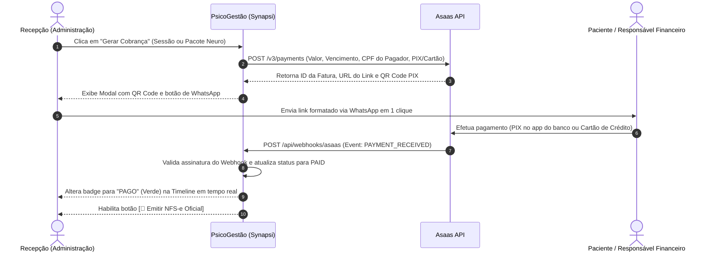

# Especificação de Design: Módulo de Cobrança Inteligente, Baixa Automática (Asaas) e Conciliação Financeira

---

## 1. Visão Geral & Contexto Estratégico

Este documento consolida a arquitetura técnica, modelo de dados, fluxos de integração bancária e a experiência do usuário (UX) para o **Módulo de Cobrança Inteligente, Conciliação Automática e Emissão Fiscal** da plataforma **PsicoGestão (Synapsi)**.

### Origem e Vantagem Competitiva Central (*Unfair Advantage*)
O projeto foi modelado diretamente para sanar os gargalos operacionais vivenciados por uma **Neuropsicóloga (CNPJ Solo)** e sua **administradora de clínica/recepção**, que utilizam o **PsicoManager** (líder de mercado no Brasil) diariamente.

Enquanto o PsicoManager peca por:
1. **Cobrança Fragmentada e Manual:** Ausência de conciliação bancária automática com PIX dinâmico no plano de entrada, forçando a recepção a cobrar comprovantes no WhatsApp e conferir extratos bancários manualmente;
2. **Desconexão com Pacotes de Neuropsicologia:** Dificuldade de faturar e gerenciar pacotes de avaliação de alto valor (ex: R$ 1.800 a R$ 4.500) divididos em parcelas mensais vinculadas ao progresso das sessões clínicas;
3. **Monetização Agressiva e Módulos Travados:** Cobrança de valores altos para emissão de notas fiscais e limites rígidos de uso;
4. **Falta de Roteamento Inteligente:** Erros comuns de envio de cobranças e lembretes para menores de idade em vez de direcionar aos responsáveis legais e financeiros.

O **PsicoGestão** posiciona-se como o antídoto definitivo para essas dores, unificando a esteira:
$$\text{Pacote Neuro Estruturado} \longrightarrow \text{Cobrança PIX/Cartão} \longrightarrow \text{Baixa Automática via Webhook} \longrightarrow \text{NFS-e em 1 Clique} \longrightarrow \text{Envio WhatsApp}$$

---

## 2. Understanding Summary (Resumo de Entendimento)

* **O que é construído:** Um ecossistema de cobrança e conciliação bancária nativo na nuvem integrado à API oficial do gateway bancário **Asaas**, com disparo de links de pagamento e PIX dinâmico para WhatsApp, baixa instantânea via Webhook, acionamento opcional de NFS-e e importador assistido de cadastros do PsicoManager.
* **Para quem é:** Especialistas em Neuropsicologia e Psicólogos atuando como Pessoa Jurídica (CNPJ Solo) com apoio de secretária/administradora, e expansível para clínicas multiprofissionais.
* **Por que existe:** Para reduzir a zero o tempo gasto na conferência de comprovantes e extratos bancários, erradicar a inadimplência oculta e proporcionar um piloto de substituição 100% indolor do PsicoManager para a clínica familiar.
* **Restrições de Segurança & Não-Custódia:** O PsicoGestão **não realiza custódia financeira**. A clínica possui sua própria conta PJ aprovada no Asaas e os valores líquidos transitam diretamente para sua conta bancária oficial. Credenciais de API são criptografadas com AES-256 no banco de dados.
* **Não-Metas Explícitas:** Não seremos uma fintech/banco proprietário; não faremos antecipação de recebíveis com risco de crédito próprio; não substituímos o contador na apuração do Simples Nacional/DAS; não faremos negativação automática em órgãos de proteção ao crédito (Serasa/SPC).

---

## 3. Decision Log (Histórico Consolidado de Decisões)

| ID | Decisão | Alternativas Consideradas | Justificativa Técnica / Negócio |
| :--- | :--- | :--- | :--- |
| **DEC-01** | **Foco no ICP de Clínicas e Especialistas Solo com Administração** | Psicólogos autônomos PF sem apoio de equipe | Alinhamento com o caso real da família (esposa neuropsicóloga + filha na recepção), permitindo teste e validação em ambiente de produção real. |
| **DEC-02** | **Conexão Direta com Gateway Asaas** | Subadquirência própria da plataforma (Synapsi Pay) ou Mercado Pago | Menor custo de transação, PIX fixo em centavos, risco zero de custódia pelo software e a API mais confiável do Brasil para serviços de saúde. |
| **DEC-03** | **Ativação por Configuração (*Feature Toggle*)** | Módulo fechado por Paywall ou Obrigatório (*Always-On*) | Garante transição suave. O sistema continua funcionando perfeitamente em modo manual tradicional até que o usuário ative a chave de API nas Configurações. |
| **DEC-04** | **Suporte a Pacotes de Neuropsicologia Parcelados** | Cobrança restrita a sessões individuais avulsas | Avaliações neuropsicológicas exigem contratação de pacotes (6 a 10 sessões) com pagamentos em até 3x a 6x com acompanhamento de vencimento. |
| **DEC-05** | **Importador de Dados do PsicoManager** | Cadastro manual de todos os pacientes do zero | Remove a maior barreira de troca de software (*switching cost*), viabilizando a transição completa da clínica para o PsicoGestão no piloto. |

---

## 4. Arquitetura de Dados (Banco de Dados SQLite)

### 4.1. Tabela de Credenciais da Clínica (`clinic_gateway_settings`)
Armazena a parametrização de integração bancária da clínica de forma segura:

```sql
CREATE TABLE IF NOT EXISTS clinic_gateway_settings (
  id INTEGER PRIMARY KEY AUTOINCREMENT,
  clinic_id INTEGER NOT NULL UNIQUE,
  provider TEXT NOT NULL DEFAULT 'ASAAS' CHECK(provider IN ('ASAAS')),
  is_active INTEGER NOT NULL DEFAULT 0,
  environment TEXT NOT NULL DEFAULT 'SANDBOX' CHECK(environment IN ('SANDBOX', 'PRODUCTION')),
  api_key_encrypted TEXT,
  webhook_token TEXT,
  default_due_days INTEGER DEFAULT 3,
  fine_percentage REAL DEFAULT 0.0,
  interest_percentage REAL DEFAULT 0.0,
  created_at DATETIME DEFAULT CURRENT_TIMESTAMP,
  updated_at DATETIME DEFAULT CURRENT_TIMESTAMP,
  FOREIGN KEY (clinic_id) REFERENCES clinic_settings(id) ON DELETE CASCADE
);
```

### 4.2. Extensão da Tabela `billings`
Campos adicionados para rastreamento de links e conciliação em tempo real:

```sql
ALTER TABLE billings ADD COLUMN gateway_payment_id TEXT;
ALTER TABLE billings ADD COLUMN payment_link_url TEXT;
ALTER TABLE billings ADD COLUMN pix_copy_paste TEXT;
ALTER TABLE billings ADD COLUMN pix_qr_code_base64 TEXT;
ALTER TABLE billings ADD COLUMN auto_reconciled INTEGER DEFAULT 0;
ALTER TABLE billings ADD COLUMN auto_reconciled_at DATETIME;
ALTER TABLE billings ADD COLUMN installment_number INTEGER DEFAULT 1;
ALTER TABLE billings ADD COLUMN total_installments INTEGER DEFAULT 1;
ALTER TABLE billings ADD COLUMN package_evaluation_id INTEGER;
```

---

## 5. Fluxos de Integração e Webhooks



### 5.1. Rota de Criação de Cobrança (`POST /api/financial/asaas/charge`)
* **Parâmetros de Entrada:**
  * `patient_id`: Identificador do paciente.
  * `session_id` ou `package_id`: Vínculo clínico do atendimento.
  * `amount`: Valor monetário da parcela ou sessão.
  * `due_date`: Data de vencimento.
  * `billing_type`: `PIX`, `CREDIT_CARD` ou `UNDEFINED` (permite ao paciente escolher na fatura).
  * `installments`: Número de parcelas (para pacotes de avaliação neuro).
* **Inteligência de Tomador:**
  * Se o paciente for menor de 18 anos, os dados de cobrança (Nome, CPF, E-mail, Celular) são automaticamente preenchidos com os do **Responsável Financeiro cadastrado**.

### 5.2. Rota de Webhook Seguro (`POST /api/webhooks/asaas`)
* **Validação de Autenticidade:**
  * Inspeciona o cabeçalho `asaas-access-token` contra o token cadastrado na tabela `clinic_gateway_settings`.
  * Se o token não coincidir, rejeita com HTTP `401 Unauthorized`.
* **Tratamento de Eventos:**
  * `PAYMENT_RECEIVED` ou `PAYMENT_CONFIRMED`:
    * Localiza a fatura via `gateway_payment_id`.
    * Altera status para `PAID`.
    * Preenche `auto_reconciled = 1` e `auto_reconciled_at = CURRENT_TIMESTAMP`.
    * Gera log de auditoria LGPD.
  * `PAYMENT_DELETED` ou `PAYMENT_OVERDUE`:
    * Atualiza o alerta visual na timeline de atendimentos para a recepção.

---

## 6. Experiência do Usuário (UX) & Interfaces

### 6.1. Configurações da Clínica (`SettingsModule.tsx`)
* Card dedicado e elegante com o logotipo do Asaas.
* Alternância entre modo **Sandbox (Testes)** e **Produção (Oficial)**.
* Exibição do status da conexão (Verde: *Conectado e Operante* / Cinza: *Modo Manual Ativo*).
* Botão para copiar a URL do Webhook com 1 clique.

### 6.2. Modal de Cobrança da Sessão / Pacote
* Exibição visual do QR Code PIX renderizado em alta definição.
* Botão **[📋 Copiar Código PIX]** com feedback instantâneo.
* Botão **[📱 Enviar WhatsApp de Cobrança]** com mensagem pré-formatada cordial, informando datas, nome do paciente e chave PIX/Link.

### 6.3. Painel da Recepção (`DailyAgendaTimeline.tsx` & `ReceptionTowerModule.tsx`)
* Badges dinâmicos e imediatos:
  * 🟠 **Pendente (Link Enviado)**: Aguardando compensação.
  * 🟢 **Pago (Automático)**: Conciliado instantaneamente via Webhook sem ação humana.
  * ⚪ **Pago (Manual)**: Para recebimentos em dinheiro vivo ou Pix tradicional.

---

## 7. Integração com a Ponta Fiscal (NFS-e)

Conforme especificado no design de NFS-e (`docs/design-modulo-emissao-nfse-premium.md`):
* Imediatamente após a conciliação automática, o sistema libera o botão **[🧾 Emitir NFS-e Oficial]**.
* Com 1 clique, o sistema consome a API da prefeitura via certificado digital A1.
* O DANFSE (PDF) e o XML são gerados, anexados aos documentos do paciente com hash SHA-256 e podem ser enviados ao pagador via WhatsApp para dedução no Imposto de Renda.

---

## 8. Módulo de Importação de Dados do PsicoManager (Transição sem Atrito)

Para garantir o sucesso do teste piloto na clínica da família e remover a barreira de saída de futuros clientes do PsicoManager:
* **Formato Suportado:** Importação de planilha CSV exportada do PsicoManager contendo a relação de pacientes ativos.
* **Mapeamento de Campos Automático:**
  * Nome Completo $\rightarrow$ `name`
  * CPF $\rightarrow$ `cpf` (com validação matemática estrita)
  * Data de Nascimento $\rightarrow$ `birth_date` (com cálculo de maioridade)
  * Telefone/WhatsApp $\rightarrow$ `phone`
  * E-mail $\rightarrow$ `email`
  * Nome e CPF dos Responsáveis $\rightarrow$ Mapeamento na tabela `patient_guardians`
* **Relatório de Importação:** Painel visual que exibe o total de cadastros processados com sucesso e lista eventuais inconsistências em segundos.

---

## 9. Roteiro de Testes e Entrada em Produção (Piloto Real)

1. **Fase 1: Validação Técnica em Sandbox (Simulado)**
   * Configurar chave de Sandbox do Asaas.
   * Criar cobrança de teste de pacote neuro (3 parcelas).
   * Simular pagamento no painel do Asaas e atestar a chegada do Webhook no backend em tempo real.
   * Testar a alteração automática do status na timeline sem F5.
2. **Fase 2: Importação dos Dados Reais da Clínica**
   * Exportar a base de pacientes ativos do PsicoManager da esposa.
   * Executar o importador e validar a integridade dos cadastros no PsicoGestão.
3. **Fase 3: Teste Piloto em Produção com Pacientes Reais**
   * Configurar chave de produção da conta PJ da esposa no Asaas.
   * Efetuar transação piloto de R$ 1,00 para homologar a compensação bancária e a baixa no sistema.
   * Acompanhar a operação diária da recepção (filha) gerando links reais de cobrança via WhatsApp para as consultas da semana.
