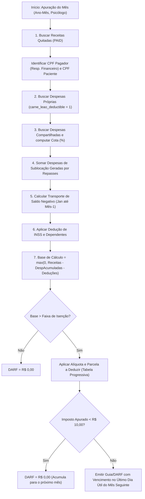

# Especificação de Design: Módulo Fiscal & Carnê-Leão Premium (Profissionais Autônomos e Consultórios Compartilhados)

## 1. Visão Geral e Propósito do Módulo
Este documento consolida a arquitetura técnica, modelo de dados, regras fiscais e a experiência do usuário para o **Módulo Fiscal & Carnê-Leão Premium** da plataforma **Psicogestão**.

O propósito central é solucionar a maior dor contábil e burocrática de psicólogos e neuropsicólogos que atuam como **Pessoa Física (Autônomos)** ou em **Consultórios Compartilhados / Coworkings Clínicos**:
- Eliminar o risco de malha fina na Receita Federal do Brasil (RFB) por inconsistência de CPF Pagador vs. Beneficiário (IN RFB nº 1.531/2015);
- Automatizar a escrituração do Livro-Caixa e as deduções legais permitidas pelo RIR/2018;
- Calcular em tempo real o imposto devido e a previsão do **DARF 0190** com aplicação da Tabela Progressiva Mensal do IRPF;
- Permitir a importação de escrituração no **Carnê-Leão Web (Portal e-CAC)** com 1 clique através de arquivos CSV rigorosamente homologados;
- Gerar um **Dossiê / DRE Fiscal em PDF Timbrado** com selo criptográfico SHA-256 para guarda obrigatória de 5 anos ou envio à contabilidade;
- Viabilizar o rateio automático de despesas comuns e a dedução automática de taxas de sublocação/sala nos 4 modelos de coworking existentes no mercado.

---

## 2. Understanding Summary (Resumo de Entendimento)
- **O que é construído:** Uma central fiscal e tributária completa para o profissional autônomo, com motor de cálculo de IRPF/DARF, Livro-Caixa com rateio de despesas, exportadores oficiais para o e-CAC e emissão de Dossiê Fiscal em PDF.
- **Para quem é:** Psicólogos clínicos e neuropsicólogos autônomos, consultórios compartilhados (2 ou mais psicólogos no mesmo endereço físico), administradores de clínicas e recepcionistas/secretárias.
- **Por que existe:** Porque nenhum software de psicologia no mercado brasileiro resolve o Carnê-Leão de ponta a ponta sem forçar o psicólogo a redigitar tudo no site da Receita ou correr risco de autuação fiscal.
- **Restrições Técnicas:** Armazenamento local SQLite com processamento backend sob demanda; total conformidade com o Regulamento do Imposto de Renda (Decreto nº 9.580/2018) e Instruções Normativas RFB nº 1.500/2014 e 1.531/2015.
- **Não-Metas Explícitas:** Não faremos robôs de automação por certificado digital dentro do e-CAC (a Receita Federal não disponibiliza API pública aberta de Carnê-Leão PF; o canal homologado e seguro é a importação de CSV); não substitui o preenchimento da Declaração de Ajuste Anual (DIRPF) de abril, embora alimente a pré-preenchida.

---

## 3. Decision Log (Histórico de Decisões)

| Decisão | Descrição | Justificativa Técnica |
| :--- | :--- | :--- |
| **DEC-01** | **Arquitetura Híbrida Configurável (PF vs. PJ)** | O usuário escolhe nas configurações se opera como Autônomo (Carnê-Leão/Livro-Caixa) ou PJ (Notas Fiscais/Contabilidade Externa), adaptando menus e relatórios. |
| **DEC-02** | **Fechamento Mensal em Tríplice Entrega** | No fim do mês, o sistema gera os 2 CSVs homologados do e-CAC (Rendimentos e Despesas) + Dossiê DRE em PDF Timbrado com SHA-256 + Guia visual ilustrado em 3 passos. |
| **DEC-03** | **Motor Fiscal Completo Automatizado** | Considera automaticamente dependentes legais (R$ 189,59/mês), INSS autônomo recolhido, deduções do Livro-Caixa, regra dos R$ 10,00 e transporte acumulado de prejuízo no ano civil. |
| **DEC-04** | **Suporte Nativo a Consultório Compartilhado** | Identidades tributárias 100% individualizadas por CPF/CRP de cada psicólogo, com recurso de rateio automático de despesas comuns da clínica (aluguel, condomínio, luz, secretária). |
| **DEC-05** | **Abordagem de Rateio Virtual Dinâmico** | Não duplica registros físicos de despesas no banco de dados. Usa flags `is_shared` e `shared_splits_json`, computando a cota de cada psicólogo sob demanda em tempo de execução (< 5ms). |
| **DEC-06** | **Blindagem de Malha Fina em Coworkings/Sublocações** | O recibo do paciente sai sempre no valor bruto integral (atendendo ao IR do paciente), e o valor retido pela clínica/sala é automaticamente escriturado como Despesa Dedutível de Sublocação no Livro-Caixa do psicólogo. |
| **DEC-07** | **Cobertura dos 4 Modelos de Coworking/Sala** | Suporte irrestrito a: 1) Taxa percentual por sessão; 2) Taxa fixa por hora/sessão; 3) Mensalidade/turno fixo recorrente; 4) Hora avulsa reservada / no-show com custo dedutível. |
| **DEC-08** | **Sigilo Ético e Fiscal Estrito (RBAC)** | Cada psicólogo só tem visibilidade de suas receitas, despesas e DARF. A secretária opera baixas e despesas sem acesso ao resumo do Carnê-Leão dos profissionais. |

---

## 4. Arquitetura do Banco de Dados (SQLite)

### 4.1 Nova Tabela: `user_fiscal_settings`
Configurações fiscais individuais de cada psicólogo cadastrado na plataforma:
```sql
CREATE TABLE IF NOT EXISTS user_fiscal_settings (
  id INTEGER PRIMARY KEY AUTOINCREMENT,
  user_id INTEGER NOT NULL UNIQUE,
  cpf TEXT NOT NULL,
  crp TEXT NOT NULL,
  cbo_code TEXT DEFAULT '2251-05',
  dependents_count INTEGER DEFAULT 0,
  inss_mode TEXT DEFAULT 'STANDARD_20' CHECK(inss_mode IN ('NONE', 'STANDARD_20', 'SIMPLIFIED_11', 'CUSTOM_FIXED')),
  inss_custom_amount REAL DEFAULT 0,
  use_simplified_deduction INTEGER DEFAULT 0,
  created_at DATETIME DEFAULT CURRENT_TIMESTAMP,
  updated_at DATETIME DEFAULT CURRENT_TIMESTAMP,
  FOREIGN KEY (user_id) REFERENCES users(id) ON DELETE CASCADE
);
CREATE INDEX IF NOT EXISTS idx_user_fiscal_user ON user_fiscal_settings(user_id);
```

### 4.2 Extensões na Tabela `expenses`
Adaptação da tabela de despesas para comportar rateio entre profissionais e categorização oficial da RFB:
```sql
ALTER TABLE expenses ADD COLUMN is_shared INTEGER DEFAULT 0;
ALTER TABLE expenses ADD COLUMN shared_splits_json TEXT; -- Ex: [{"userId": 1, "percent": 50}, {"userId": 2, "percent": 50}]
ALTER TABLE expenses ADD COLUMN rfb_account_code TEXT; -- Ex: 'ALUGUEL_SUBLOCACAO', 'CONDOMINIO_IPTU', 'ENERGIA_AGUA_TEL', 'CRP_ANUIDADE', 'HONORARIOS_SECRETARIA'
```

### 4.3 Extensão na Tabela `clinic_settings`
```sql
ALTER TABLE clinic_settings ADD COLUMN operational_tax_mode TEXT DEFAULT 'AUTONOMOUS' CHECK(operational_tax_mode IN ('AUTONOMOUS', 'CLINIC_PJ'));
```

---

## 5. Engenharia do Motor de Cálculo Fiscal (`fiscalService.ts`)

O motor de apuração executa a seguinte esteira determinística para uma dada competência (Ano e Mês) e para um dado `psychologist_id`:



### Regras de Negócio Críticas do Motor:
1. **Regra de Transporte de Prejuízo do Livro-Caixa:**  
   Se no mês $M$ as despesas dedutíveis forem maiores que as receitas, o excesso é acumulado como crédito dedutível para o mês $M+1$. No dia 31 de dezembro de cada ano, qualquer saldo negativo acumulado é zerado, respeitando estritamente o Art. 75 do RIR/2018.
2. **Identificação Precisa do Pagador:**  
   Ao processar cada transação, o sistema verifica `patients.financial_responsible_json`. Se houver `fullName` e `cpf`, estes são utilizados como `CPF do Titular do Pagamento`. Caso contrário, utiliza os dados do próprio paciente. O CPF do paciente é mantido sempre no campo `CPF do Beneficiário`.
3. **Conversão de Taxa de Sala em Despesa Dedutível:**  
   Sessões processadas em lotes de repasse (`repasse_batches`) com retenção pela clínica geram automaticamente despesa dedutível da categoria `ALUGUEL_SUBLOCACAO` no livro-caixa do psicólogo correspondente.

---

## 6. Layouts de Exportação Homologados (Receita Federal / e-CAC)

### 6.1 Arquivo CSV de Rendimentos (`rendimentos_carne_leao_[ANO]_[MES].csv`)
- **Padrão:** UTF-8 com separador ponto e vírgula (`;`).
- **Formatação numérica:** Decimais com vírgula (ex: `250,00`), sem ponto separador de milhar.
- **Formatação de datas:** `DD/MM/AAAA`.
- **Estrutura de Colunas:**
  1. `Data do Lançamento` (DD/MM/AAAA)
  2. `Código do Rendimento` (Código de prestação de serviços a PF)
  3. `Código da Ocupação` (`2251-05` ou `2515-10` - Psicólogo Clínico)
  4. `Valor Recebido` (ex: `200,00`)
  5. `Valor da Dedução` (`0,00`)
  6. `Histórico` (ex: `Honorários Profissionais de Serviços Psicológicos`)
  7. `Recebido de` (`PF`)
  8. `CPF do Titular do Pagamento` (Apenas números, 11 dígitos)
  9. `CNPJ` (Vazio para recebimentos de PF)
  10. `CPF do Beneficiário do Serviço` (Apenas números, 11 dígitos)

### 6.2 Arquivo CSV de Despesas/Pagamentos (`despesas_livro_caixa_[ANO]_[MES].csv`)
- **Estrutura de Colunas:**
  1. `Data do Pagamento` (DD/MM/AAAA)
  2. `Código da Conta RFB` (Conforme Tabela Auxiliar de Contas do Carnê-Leão Web)
  3. `Valor Pago` (ex: `1500,00`)
  4. `Histórico` (ex: `Cota-parte de Aluguel e Condomínio do Consultório`)
  5. `CPF/CNPJ do Favorecido` (Documento do locador ou fornecedor)

---

## 7. Dossiê / DRE Fiscal em PDF Timbrado (Guarda por 5 Anos)

O documento oficial para comprovação perante a Receita Federal ou envio à assessoria contábil inclui:
1. **Cabeçalho com Timbre do Consultório e Identificação do Psicólogo:** Nome completo, CPF, CRP, endereço e contato;
2. **Quadro Demonstrativo de Resultados do Mês (DRE Fiscal):**
   - (+) Receitas Brutas de Honorários (Total e relação nominal de pacientes/CPFs);
   - (-) Despesas Diretas Escrituradas;
   - (-) Cota-parte de Despesas Compartilhadas do Consultório;
   - (-) Sublocações / Taxas de Sala Retidas;
   - (-) Saldo Negativo Transportado de Competências Anteriores;
   - (=) Saldo Operacional do Livro-Caixa;
   - (-) Deduções Pessoais: INSS Oficial Recolhido e Dependentes Legais;
   - (=) **Base de Cálculo do IRPF**;
3. **Quadro de Apuração do Imposto:**
   - Faixa da Tabela Progressiva do IRPF;
   - Alíquota Efetiva e Parcela a Deduzir;
   - **Valor Final do DARF 0190** e Data Limite de Pagamento;
4. **Selo de Autenticidade Criptográfico (SHA-256):**
   - Hash gerado a partir da concatenação de `psychologist_cpf|competence|total_revenue|total_expense|darf_amount`;
   - Carimbo digital com garantia de integridade documental.

---

## 8. Interface do Usuário (Frontend React)

1. **Aba "Perfil Fiscal & Tributário" em Configurações:**
   - Seletor de Modo Operacional (Autônomo vs. Clínica PJ);
   - Formulário de dados fiscais (CPF, CRP, número de dependentes, modalidade de INSS).
2. **Aba "Carnê-Leão & Livro-Caixa" no Módulo Financeiro:**
   - Visualização do Card Previsão de DARF com data de vencimento e badge de alerta fiscal;
   - Tabela de lançamentos com pílulas para `[ Rendimentos ]` e `[ Livro-Caixa ]`;
   - Seletor de competência (Ano e Mês);
   - Seletor de profissional (em consultórios compartilhados multi-autônomos, respeitando permissões RBAC).
3. **Modal de Fechamento Mensal ("Exportar Carnê-Leão"):**
   - Botão para download do CSV de Rendimentos (e-CAC);
   - Botão para download do CSV de Despesas (e-CAC);
   - Botão para gerar e imprimir o Dossiê Fiscal em PDF;
   - Guia visual passo a passo para o portal e-CAC.
4. **Extensão no Modal de Cadastro de Despesas:**
   - Toggle *"Despesa Compartilhada do Consultório"*, exibindo a relação de psicólogos e inputs percentuais com validação em tempo real de soma 100%.

---

## 9. Política de Segurança, Sigilo e RBAC

- **Isolamento entre Psicólogos:** Em consultas à API do Carnê-Leão, o backend valida o token JWT (`req.user.id`). Psicólogos comuns só podem consultar seus próprios dados. Tentar consultar `psychologistId` de outro colega retorna `403 Forbidden`.
- **Acesso Administrativo:** Administradores têm permissão para gerenciar despesas compartilhadas e regras de rateio de salas.
- **Perfil de Recepção / Secretária:** Pode registrar baixas de pagamentos de sessões e cadastrar despesas da clínica, mas não visualiza o valor de imposto nem a apuração do Carnê-Leão dos profissionais sem a permissão expressa `view_fiscal_reports`.

---

## 10. Conclusão e Próximos Passos
Este design fornece a fundação completa para transformar o Psicogestão na solução de referência nacional para gestão fiscal de psicólogos autônomos e consultórios compartilhados.
