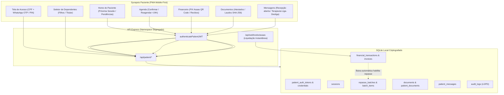

# Synapsis Paciente — Especificação Técnica & Arquitetural do Módulo de Acesso

**Solução Bilateral de Autoatendimento, Comunicação Ética, Conciliação Financeira e Engajamento Terapêutico para Pacientes e Responsáveis**

---

## 1. Resumo de Entendimento (Understanding Summary)

* **O que é:** O **Synapsis Paciente** é uma aplicação web progressiva (PWA Mobile-First) integrada ao ecossistema PsicoGestão/Synapsis, provendo uma área exclusiva e acolhedora para pacientes e seus responsáveis legais/financeiros.
* **Para quem é:** Pacientes em psicoterapia ou avaliação neuropsicológica, bem como pais, tutores ou responsáveis por dependentes menores de idade ou idosos.
* **Por que existe:** Para eliminar fricções operacionais da clínica (reduzir o absenteísmo/no-show, automatizar cobranças via PIX e liberação de recibos de IRPF) e fortalecer a adesão terapêutica (aplicação de escalas como PHQ-9/GAD-7 e diários), mantendo a recepção eficiente e preservando os limites de contato dos terapeutas.
* **Módulos Disponíveis:**
  1. **Agenda:** Confirmação de presença em 1 toque, consulta de horários e reagendamento com trava inteligente de antecedência de 24h.
  2. **Financeiro Polimórfico:** Pagamento instantâneo via PIX Copia e Cola / QR Code com conciliação automática (Asaas), histórico de sessões pagas e download de recibos com CPF/CRP e Notas Fiscais (NFSe). Adapta-se automaticamente ao modelo do consultório (Autônomo, Pequena ou Grande Clínica).
  3. **Cofre de Documentos Oficiais:** Acesso seguro para download de Atestados, Declarações de Comparecimento, Relatórios/Laudos autorizados e Contrato Terapêutico/TCLE.
  4. **Atividades & Escalas:** Autoaplicação de instrumentos padronizados e registros de tarefas entre sessões.
  5. **Mensageria em Duas Vias:** Canal Administrativo (Recepção) aberto por padrão e Canal Clínico (Terapeuta) com controle granular liga/desliga individual ou global pelo psicólogo, horários visíveis e rodapé compulsório de emergência (CVV 188).
* **Restrições Ético-Legais & Não-Objetivos (Explicit Non-Goals):**
  * **NÃO-OBJETIVO (Sigilo Profissional CFP 01/2009 e 06/2019):** O paciente **nunca** acessa evoluções clínicas brutas, anotações de sessões (DAP/BIRP) ou notas confidenciais privativas do psicólogo.
  * **NÃO-OBJETIVO (Plantão 24/7):** O app não opera como pronto-socorro psicológico ou emergência psiquiátrica em tempo real.
  * **NÃO-OBJETIVO (Fase 1 sem Lojas de Apps):** Não depende de downloads em Google Play ou Apple App Store; opera 100% via PWA direto no navegador com opção de instalar na tela inicial.

---

## 2. Requisitos Não Funcionais & Premissas (Assumptions)

* **Segurança e Identidade:** Autenticação sem senhas alfanuméricas complexas, baseada em CPF + código OTP (WhatsApp/SMS) com validade de 10 minutos, com opção de PIN de 4 dígitos criptografado com bcrypt no dispositivo.
* **Privacidade e LGPD:** Trilha de auditoria indelével (`audit_logs`) para toda e qualquer visualização ou download de documentos de saúde sensíveis. Time-out automático de sessão após 15 minutos de inatividade.
* **Desempenho Mobile:** Carregamento ultra-leve (< 1.5s em redes móveis 4G) via *lazy loading* do pacote do paciente, isolado dos componentes administrativos pesados do ERP.
* **Isolamento de Acesso (Zero Trust):** Middleware específico `authenticatePatientJWT` que valida claims exclusivas (`role: 'patient'`, `patient_id`), blindando o acesso contra qualquer rota interna da clínica.

---

## 3. Registro de Decisões (Decision Log)

| # | Decisão Adotada | Alternativas Consideradas | Motivação da Escolha |
| :-: | :--- | :--- | :--- |
| **01** | **PWA / Web Mobile-First** via link seguro no WhatsApp | Aplicativo Nativo (App Store/Play Store) | Elimina a barreira de download e cadastro em lojas; adesão imediata de 100% dos pacientes, inclusive idosos. |
| **02** | **Documentos Oficiais CFP liberados; Evoluções brutas 100% blindadas** | Expor prontuário bruto ou limitar apenas a financeiro/agenda | Respeita estritamente o sigilo profissional (Res. CFP 01/2009 e 06/2019) enquanto entrega alto valor legal/fiscal ao paciente. |
| **03** | **Mensageria em Duas Vias com Liga/Desliga Clínico** | Chat aberto 24/7 unificado ou canal exclusivo da recepção | Protege o psicólogo contra trabalho invisível e burnout fora de horário, mantendo canal administrativo aberto para a clínica. |
| **04** | **Autenticação via OTP WhatsApp + PIN + Multi-Dependentes** | E-mail e senha alfanumérica tradicional | Pacientes frequentemente esquecem senhas; permite que pais com mais de um filho alternem perfis familiares com 1 toque. |
| **05** | **Agenda com Trava de Antecedência de 24h** | Cancelamento livre sem regras ou aprovação humana obrigatória | Protege a receita da clínica e a remuneração do profissional contra no-shows de última hora, liberando a recepção de trocas rotineiras. |
| **06** | **SPA Monorepo com Namespace `/api/patient/*` e rota `/paciente`** | Repositório desacoplado ou monólito misturado no `App.tsx` | Mantém deploy único e manutenção simples sem misturar estados e pesos de código entre ERP interno e visão do paciente. |
| **07** | **Polimorfismo Financeiro por Porte da Clínica** | Modelo único rígido de pagamento | Atende com perfeição desde o psicólogo autônomo individual (Carnê-Leão e PIX direto) até policlínicas com NFSe e repasses em lote. |
| **08** | **Onboarding Direcionado via Ficha do Paciente (WhatsApp/E-mail) & Magic Link com PIN** | Botões públicos no ERP principal ou criação de senhas complexas | Preserva a clareza da recepção no ERP interno, garante envio nominal humanizado e permite acesso imediato sem burocracia. |

---

## 4. Arquitetura Técnica & Modelo de Dados

### 4.1. Diagrama de Fluxo e Componentes



### 4.2. Novas Estruturas no Banco de Dados (SQLite)

```sql
-- 1. Tokens OTP de Primeiro Acesso e Validação por WhatsApp
CREATE TABLE IF NOT EXISTS patient_auth_tokens (
  id INTEGER PRIMARY KEY AUTOINCREMENT,
  patient_id INTEGER NOT NULL,
  phone_used TEXT NOT NULL,
  otp_code TEXT NOT NULL,
  attempts INTEGER NOT NULL DEFAULT 0,
  expires_at DATETIME NOT NULL,
  used_at DATETIME,
  created_at DATETIME DEFAULT CURRENT_TIMESTAMP,
  FOREIGN KEY (patient_id) REFERENCES patients(id) ON DELETE CASCADE
);

-- 2. Credenciais de Desbloqueio Rápido (PIN Local)
CREATE TABLE IF NOT EXISTS patient_credentials (
  id INTEGER PRIMARY KEY AUTOINCREMENT,
  patient_id INTEGER NOT NULL UNIQUE,
  pin_hash TEXT,
  failed_attempts INTEGER NOT NULL DEFAULT 0,
  locked_until DATETIME,
  last_login_at DATETIME,
  created_at DATETIME DEFAULT CURRENT_TIMESTAMP,
  updated_at DATETIME DEFAULT CURRENT_TIMESTAMP,
  FOREIGN KEY (patient_id) REFERENCES patients(id) ON DELETE CASCADE
);

-- 3. Mensageria em Duas Vias (Comunicação Clínica e Administrativa)
CREATE TABLE IF NOT EXISTS patient_messages (
  id INTEGER PRIMARY KEY AUTOINCREMENT,
  patient_id INTEGER NOT NULL,
  channel_type TEXT NOT NULL CHECK(channel_type IN ('ADMINISTRATIVE', 'CLINICAL')),
  sender_type TEXT NOT NULL CHECK(sender_type IN ('PATIENT', 'RECEPTION', 'PSYCHOLOGIST')),
  sender_user_id INTEGER, -- Preenchido quando enviado por secretária ou psicólogo
  message_text TEXT NOT NULL,
  attachment_url TEXT,
  attachment_name TEXT,
  is_read INTEGER NOT NULL DEFAULT 0,
  read_at DATETIME,
  created_at DATETIME DEFAULT CURRENT_TIMESTAMP,
  FOREIGN KEY (patient_id) REFERENCES patients(id) ON DELETE CASCADE,
  FOREIGN KEY (sender_user_id) REFERENCES users(id)
);

CREATE INDEX IF NOT EXISTS idx_patient_messages_patient ON patient_messages(patient_id, channel_type);

-- 4. Atividades e Diários Terapêuticos
CREATE TABLE IF NOT EXISTS patient_activities (
  id INTEGER PRIMARY KEY AUTOINCREMENT,
  patient_id INTEGER NOT NULL,
  psychologist_id INTEGER NOT NULL,
  title TEXT NOT NULL,
  description TEXT,
  activity_type TEXT NOT NULL CHECK(activity_type IN ('DIARY', 'SCALE_PHQ9', 'SCALE_GAD7', 'HOMEWORK')),
  status TEXT NOT NULL DEFAULT 'PENDING' CHECK(status IN ('PENDING', 'COMPLETED', 'EXPIRED')),
  response_json TEXT,
  due_date DATE,
  completed_at DATETIME,
  created_at DATETIME DEFAULT CURRENT_TIMESTAMP,
  FOREIGN KEY (patient_id) REFERENCES patients(id) ON DELETE CASCADE,
  FOREIGN KEY (psychologist_id) REFERENCES users(id)
);
```

---

## 5. Especificação dos Fluxos e Módulos

### 5.1. Fluxo de Autenticação & Suporte Multi-Dependentes
1. **Entrada por CPF:** O usuário acessa `/paciente` no celular e digita seu CPF.
2. **Resolução de Papel:**
   * Se o CPF for de um paciente adulto titular: Dispara OTP de 6 dígitos via WhatsApp para o telefone do cadastro.
   * Se o CPF pertencer a um responsável legal (`guardian_json`) com um ou mais filhos cadastrados: O sistema localiza todos os filhos vinculados.
3. **Validação OTP e Criação de PIN:**
   * Ao informar o código correto, o usuário acessa o sistema e pode configurar um PIN de 4 dígitos para acessos instantâneos futuros.
4. **Hub Familiar:**
   * O responsável visualiza um seletor com cartões dos dependentes (ex: *Lucas - 8 anos*, *Mariana - 14 anos*). Ao clicar, o contexto da aplicação alterna instantaneamente para o dependente escolhido, mantendo o histórico de cada um completamente isolado.

### 5.2. Módulo de Agenda & Regras de Trava 24h
* **Visualização da Consulta:** Card destacado com a próxima sessão. Se for modalidade online, o botão *"Entrar na Sala Virtual"* é desbloqueado 10 minutos antes da consulta.
* **Confirmação Instantânea:** O paciente clica em *"Confirmar Presença"*; o sistema atualiza em tempo real a Torre de Controle da Recepção e a Agenda do psicólogo para `CONFIRMED`.
* **Política de Reagendamento / Cancelamento:**
  * **Antecedência > 24h:** O paciente visualiza a grade de horários disponíveis daquele terapeuta e conclui a remarcação automaticamente, liberando a vaga antiga na agenda.
  * **Antecedência < 24h:** O app exibe o aviso contratual de sessão sujeita a cobrança e gera uma *"Solicitação de Urgência"* com justificativa enviada diretamente à Recepção.

### 5.3. Módulo Financeiro Polimórfico & Conciliação Asaas
* **Liquidação por PIX Dinâmico:** Para cada atendimento pendente, o app disponibiliza o QR Code e o código "Copia e Cola" gerado via integração Asaas.
* **Automação Cruzada com Repasses:**
  1. O paciente realiza o pagamento no aplicativo bancário.
  2. O Webhook do gateway processa a quitação no servidor em segundos.
  3. A transação muda para `PAID`, liberando o recibo timbrado de IRPF para download no app.
  4. A sessão entra automaticamente na lista de sessões elegíveis para o **Lote de Repasse do Psicólogo**, blindando a clínica contra adiantamentos indevidos.
* **Diferenciação por Porte:**
  * *Autônomo:* Pagamento direto na chave PIX do psicólogo, com emissão de recibo de pessoa física (Carnê-Leão).
  * *Clínicas:* Pagamento centralizado na conta da clínica com emissão de NFSe e cálculo da comissão de repasse.

### 5.4. Módulo de Comunicação com Controle Liga/Desliga
* **Canal Recepção (Administrativo):** Aberto por padrão para tirar dúvidas de horários, emissão de declarações e dados de pagamento.
* **Canal Clínico (Psicólogo):**
  * Desativado por padrão.
  * O terapeuta pode ativar globalmente para seus pacientes ou habilitar individualmente para casos que exigem acompanhamento próximo.
  * Configuração de expediente: mensagens fora da janela horária recebem mensagem cordial de ausência.
  * Rodapé obrigatório com o link de discagem rápida para o **CVV (188)**.

---

## 6. Segurança, LGPD e Casos de Borda

1. **Prevenção contra IDOR (*Insecure Direct Object References*):**
   * Toda consulta no namespace `/api/patient/*` valida se o `patient_id` requisitado pertence estritamente ao paciente autenticado no token JWT ou a um dependente legal validado. Nenhuma informação é retornada baseada apenas em parâmetros de URL.
2. **Proteção de Transição de Maioridade (18 anos):**
   * Ao atingir a data de 18 anos, o acesso do responsável legal aos dados clínicos e atestados é pausado preventivamente, garantindo a privacidade do jovem conforme o Código de Ética do CFP e a legislação brasileira.
3. **Integridade de Documentos com Hash SHA-256:**
   * Todos os atestados e laudos baixados pelo paciente contêm o selo com hash criptográfico SHA-256 no rodapé, permitindo que escolas, tribunais ou planos de saúde comprovem a autenticidade do documento emitido pela clínica.
